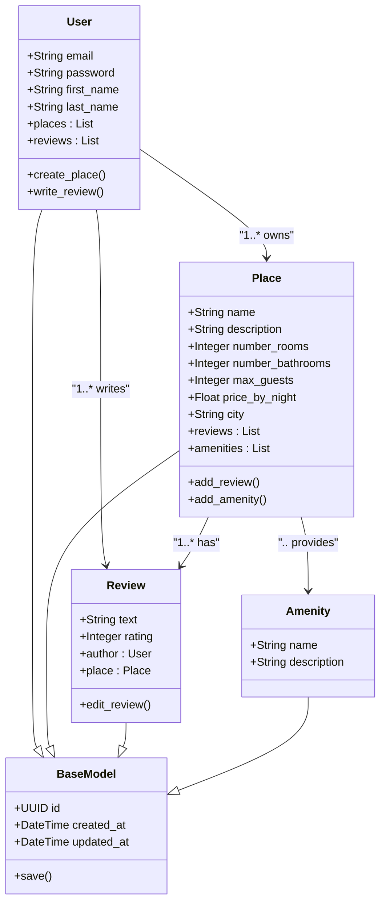

```mermaid
classDiagram
    class BaseModel {
        +UUID id
        +DateTime created_at
        +DateTime updated_at
        +save()
    }

    class User {
        +String email
        +String password
        +String first_name
        +String last_name
        +places : List<Place>
        +reviews : List<Review>
        +create_place()
        +write_review()
    }

    class Place {
        +String name
        +String description
        +Integer number_rooms
        +Integer number_bathrooms
        +Integer max_guests
        +Float price_by_night
        +String city
        +reviews : List<Review>
        +amenities : List<Amenity>
        +add_review()
        +add_amenity()
    }

    class Review {
        +String text
        +Integer rating
        +author : User
        +place : Place
        +edit_review()
    }

    class Amenity {
        +String name
        +String description
    }

    %% Relations
    User --> Place : "1..* owns"
    User --> Review : "1..* writes"
    Place --> Review : "1..* has"
    Place --> Amenity : "*..* provides"

    %% Inheritance
    User --|> BaseModel
    Place --|> BaseModel
    Review --|> BaseModel
    Amenity --|> BaseModel
```