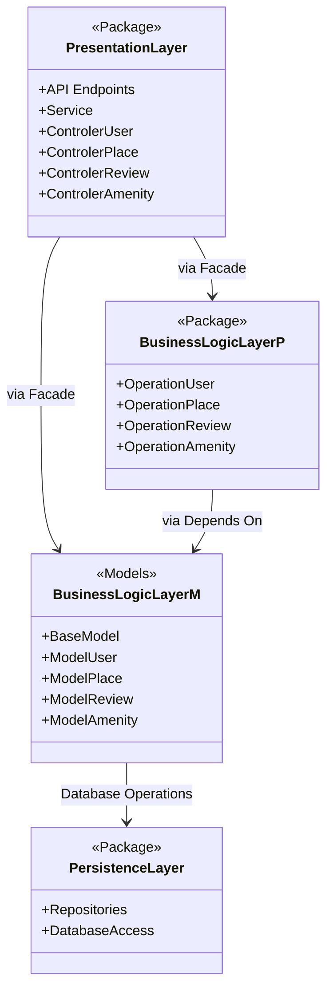

%% HBnB - 3 Layer Architecture with Facade

```mermaid
classDiagram
    %% --- Packages ---
    class PresentationLayer {
        <<Package>>
        +API Endpoints
        +Service
        +ControlerUser
        +ControlerPlace
        +ControlerReview
        +ControlerAmenity
    }

    class BusinessLogicLayerP {
        <<Package>>
        +OperationUser
        +OperationPlace
        +OperationReview
        +OperationAmenity
    }

    class BusinessLogicLayerM {
        <<Models>>
        +BaseModel
        +ModelUser
        +ModelPlace
        +ModelReview
        +ModelAmenity
    }

    class PersistenceLayer {
        <<Package>>
        +Repositories
        +DatabaseAccess
    }

    %% --- Relations ---
    PresentationLayer --> BusinessLogicLayerP : via Facade
    PresentationLayer --> BusinessLogicLayerM : via Facade
    BusinessLogicLayerP --> BusinessLogicLayerM : via Depends On
    BusinessLogicLayerM --> PersistenceLayer : Database Operations
```