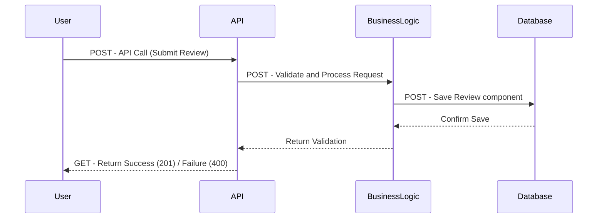

```mermaid
sequenceDiagram
participant User
participant API
participant BusinessLogic
participant Database

User->>API: POST - API Call (Submit Review)
API->>BusinessLogic: POST - Validate and Process Request
BusinessLogic->>Database: POST - Save Review component
Database-->>BusinessLogic: Confirm Save
BusinessLogic-->>API: Return Validation
API-->>User: GET - Return Success (201) / Failure (400)
```