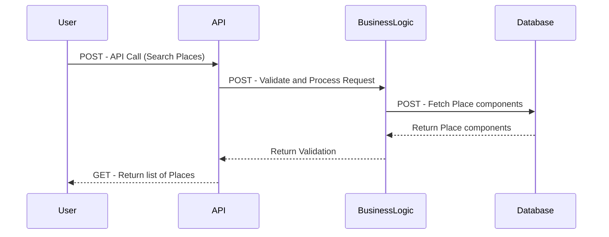

```mermaid
sequenceDiagram
participant User
participant API
participant BusinessLogic
participant Database

User->>API: POST - API Call (Search Places)
API->>BusinessLogic: POST - Validate and Process Request
BusinessLogic->>Database: POST - Fetch Place components
Database-->>BusinessLogic: Return Place components
BusinessLogic-->>API: Return Validation
API-->>User: GET - Return list of Places
```