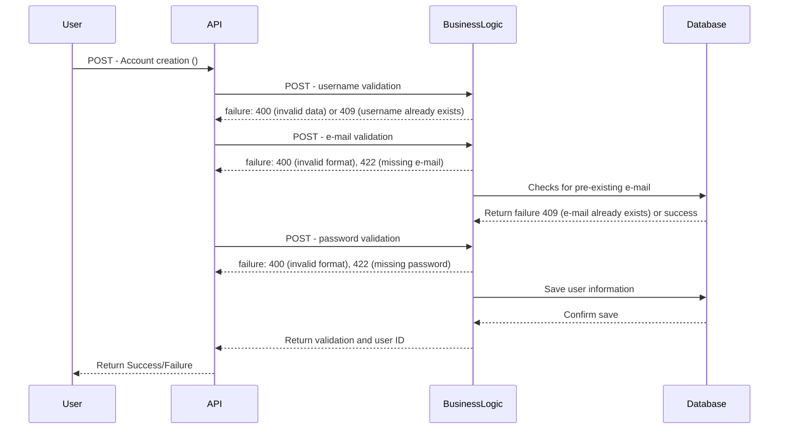

```mermaid
sequenceDiagram
participant User
participant API
participant BusinessLogic
participant Database

User->>API: POST - Account creation ()
API->>BusinessLogic: POST - username validation
BusinessLogic-->>API: failure: 400 (invalid data) or 409 (username already exists)
API->>BusinessLogic: POST - e-mail validation
BusinessLogic-->>API: failure: 400 (invalid format), 422 (missing e-mail)
BusinessLogic->>Database: Checks for pre-existing e-mail
Database-->>BusinessLogic: Return failure 409 (e-mail already exists) or success
API->>BusinessLogic: POST - password validation
BusinessLogic-->>API: failure: 400 (invalid format), 422 (missing password)
BusinessLogic->>Database: Save user information
Database-->>BusinessLogic: Confirm save
BusinessLogic-->>API: Return validation and user ID
API-->>User: Return Success/Failure
```